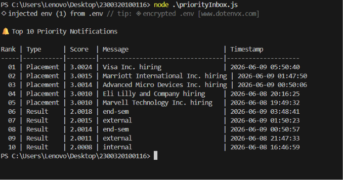

# Stage 1

## Notification JSON Schema
```json
{
  "id": "uuid",
  "userId": "uuid",
  "type": "placement | event | result",
  "title": "string",
  "message": "string",
  "isRead": "boolean",
  "createdAt": "ISO8601"
}
```

## Core Actions
- Fetch notifications
- Mark as read
- Delete notification
- Create notification (admin)
- Real-time stream

## Endpoints

### GET /api/v1/notifications
**Headers:** `Authorization: Bearer <token>`
**Request Body:** None
**Query Params:** `type`, `unread`, `page`, `limit`
**Response 200:**
```json
{
  "success": true,
  "data": [
    {
      "id": "uuid",
      "type": "placement | event | result",
      "title": "string",
      "message": "string",
      "isRead": false,
      "createdAt": "ISO8601"
    }
  ],
  "pagination": { "page": 1, "limit": 20, "total": 100 }
}
```

### GET /api/v1/notifications/:id
**Headers:** `Authorization: Bearer <token>`
**Request Body:** None
**Response 200:** single notification object (same schema above)
**Response 404:** `{ "success": false, "error": "Not found" }`

### POST /api/v1/notifications
**Headers:** `Authorization: Bearer <admin_token>`
**Request Body:**
```json
{ "userId": "uuid", "type": "event", "title": "string", "message": "string" }
```
**Response 201:** created notification object

### PATCH /api/v1/notifications/:id/read
**Headers:** `Authorization: Bearer <token>`
**Request Body:** None
**Response 200:** `{ "success": true, "id": "uuid", "isRead": true }`

### PATCH /api/v1/notifications/read-all
**Headers:** `Authorization: Bearer <token>`
**Request Body:** None
**Response 200:** `{ "success": true, "updatedCount": 12 }`

### DELETE /api/v1/notifications/:id
**Headers:** `Authorization: Bearer <token>`
**Request Body:** None
**Response 200:** `{ "success": true, "message": "Deleted" }`

## Real-Time: SSE

**GET /api/v1/notifications/stream**
**Headers:** `Authorization: Bearer <token>`, `Accept: text/event-stream`
**Request Body:** None

Server pushes event on new notification:
```
data: {"id":"uuid","type":"placement","title":"string","createdAt":"ISO8601"}
```

## Stage 2

### Database Choice: PostgreSQL

Notifications have a fixed schema, need filtering/sorting by userId, type, isRead — relational fits naturally. PostgreSQL also supports indexing well for the query patterns needed.

---

### Schema

```sql
CREATE TABLE notifications (
  id UUID PRIMARY KEY DEFAULT gen_random_uuid(),
  user_id UUID NOT NULL,
  type VARCHAR(20) NOT NULL CHECK (type IN ('placement', 'event', 'result')),
  title VARCHAR(255) NOT NULL,
  message TEXT NOT NULL,
  is_read BOOLEAN DEFAULT FALSE,
  created_at TIMESTAMPTZ DEFAULT NOW()
);
```

---

### Indexes

```sql
CREATE INDEX idx_notifications_user_id ON notifications(user_id);
CREATE INDEX idx_notifications_user_unread ON notifications(user_id, is_read);
CREATE INDEX idx_notifications_created_at ON notifications(created_at DESC);
```

---

### Scalability Problems & Solutions

| Problem | Solution |
|--------|----------|
| Table grows huge over time | Partition by `created_at` (monthly) |
| Slow queries at scale | Indexes on `user_id`, `is_read` |
| Too many reads on one DB | Read replicas |
| Old notifications rarely accessed | Archive rows older than 90 days to cold storage |

---

### Queries (matching Stage 1 APIs)

**GET /notifications**
```sql
SELECT * FROM notifications
WHERE user_id = $1
ORDER BY created_at DESC
LIMIT $2 OFFSET $3;
```

**GET /notifications?unread=true&type=placement**
```sql
SELECT * FROM notifications
WHERE user_id = $1 AND is_read = FALSE AND type = $2
ORDER BY created_at DESC
LIMIT $3 OFFSET $4;
```

**GET /notifications/:id**
```sql
SELECT * FROM notifications
WHERE id = $1 AND user_id = $2;
```

**POST /notifications**
```sql
INSERT INTO notifications (user_id, type, title, message)
VALUES ($1, $2, $3, $4)
RETURNING *;
```

**PATCH /notifications/:id/read**
```sql
UPDATE notifications
SET is_read = TRUE
WHERE id = $1 AND user_id = $2;
```

**PATCH /notifications/read-all**
```sql
UPDATE notifications
SET is_read = TRUE
WHERE user_id = $1 AND is_read = FALSE;
```

**DELETE /notifications/:id**
```sql
DELETE FROM notifications
WHERE id = $1 AND user_id = $2;
```

## Stage 3

### Query Analysis

```sql
SELECT * FROM notifications
WHERE studentID = 1042 AND isRead = false
ORDER BY createdAt DESC;
```

**Is it accurate?** Yes, logically correct. Returns unread notifications for a student in reverse chronological order.

**Why is it slow?**
- No index on `studentID` or `isRead` — full table scan on 5M rows
- `SELECT *` fetches all columns unnecessarily
- `ORDER BY createdAt DESC` requires sorting the entire result set

---

### Fix

```sql
CREATE INDEX idx_notifications_student_read ON notifications(studentID, isRead, createdAt DESC);

SELECT id, title, message, notificationType, createdAt
FROM notifications
WHERE studentID = 1042 AND isRead = false
ORDER BY createdAt DESC;
```

**Cost before:** O(N) full scan — 5M rows scanned  
**Cost after:** O(log N + K) — index seek, K = matching rows only

---

### Indexing Every Column — Bad Idea

No. Each index adds write overhead on every INSERT/UPDATE/DELETE. With 5M notifications and frequent writes, indexing every column will slow down writes significantly and waste storage. Only index columns used in WHERE, ORDER BY, or JOIN clauses.

---

### Placement Notifications — Last 7 Days

```sql
SELECT DISTINCT studentID
FROM notifications
WHERE notificationType = 'Placement'
  AND createdAt >= NOW() - INTERVAL '7 days';
```

## Stage 4

### Problem
Every page load hits the DB directly — 50,000 students fetching notifications causes read overload.

---

### Solution: Caching with Redis

Cache notification results in Redis on first fetch. Serve subsequent requests from cache, not DB.

**Flow:**
1. Request comes in
2. Check Redis — if hit, return cached result
3. If miss, query DB, store result in Redis with TTL, return result

---

### Performance Improvements & Tradeoffs

| Strategy | How it improves performance | Tradeoffs |
|----------|-----------------------------|-----------|
| **Redis Caching (Read-through)** | Offloads 90%+ of read requests from PostgreSQL to memory. Redis is highly optimized for fast key-value lookups, reducing latency from milliseconds to microseconds. | **Cache Invalidations:** When a notification is marked read or deleted, the cache must be purged or updated. **Cost:** Requires additional infrastructure (Redis). Stale data might occasionally be served if invalidation fails. |
| **Pagination & Limits** | Prevents clients from fetching thousands of notifications at once. Fetches only 20 at a time per page. | **UX Tradeoff:** Users must click "Load More" or navigate to next pages. Doesn't solve the overload if all 50k students request page 1 simultaneously. |
| **Server-Sent Events (SSE)** | Reduces polling. Instead of clients repeatedly polling the server every X seconds on page load, SSE keeps an open connection and pushes updates only when they occur. | **Resource Tradeoff:** High number of persistent open connections can consume server memory. Requires a load balancer configured for long-lived HTTP connections. |


## Stage 5

### Shortcomings in Current Implementation

- **Synchronous loop** — 50,000 iterations blocking a single thread. Extremely slow.
- **No error handling** — if `send_email` fails, loop continues with no retry or record of failure.
- **Tight coupling** — email, DB insert, and SSE push happen sequentially. One failure affects the rest.
- **No atomicity** — partial failures leave inconsistent state (email sent but DB not saved, or vice versa).

---

### Email Failed for 200 Students

No way to identify which 200 failed. No retry mechanism. Those students simply don't get notified — silently.

---

### Should DB save and email happen together?

No. They should be decoupled. DB insert is fast and local. Email depends on an external API that can fail, be slow, or rate-limit. Coupling them means an email failure rolls back or skips the DB record, leaving no trace of the notification.

**Save to DB first, always. Email is a side effect.**

---

### Redesign: Message Queue

Push all 50,000 jobs into a queue. Workers process them asynchronously in parallel. Failed jobs are retried automatically.

---

### Revised Pseudocode

```
function notify_all(student_ids: array, message: string):
    for student_id in student_ids:
        enqueue("notification_queue", {
            student_id: student_id,
            message: message,
            status: "pending"
        })

# Worker (runs in parallel, multiple instances)
function worker():
    while true:
        job = dequeue("notification_queue")

        try:
            save_to_db(job.student_id, job.message)
            send_email(job.student_id, job.message)
            push_to_app(job.student_id, job.message)
            mark_job_done(job)
        catch error:
            if job.retries < 3:
                re_enqueue(job with retries + 1)
            else:
                move_to_dead_letter_queue(job)
```

---

### Tradeoffs

| Approach | Benefit | Tradeoff |
|----------|---------|----------|
| Message queue | Async, parallel, retryable | Adds infra (Redis/Kafka) |
| Dead letter queue | Failed jobs captured, no silent loss | Needs manual review process |
| DB first, email async | Consistent state regardless of email failure | Slight delay between DB save and email delivery |

## Stage 6

### Approach

Each notification gets a **score** combining type weight and recency:

- Placement = 3, Result = 2, Event = 1
- Recency score = `1 / (1 + ageInMinutes)` — decays over time, never zero

```
score = typeWeight + recencyScore
```

### Maintaining Top N Efficiently (as new notifications arrive)

Use a **min-heap of size N**. For each new notification:
- If heap has < N items → push
- If new score > heap minimum → replace root, re-heapify

**Cost:** O(log N) per new notification vs O(N log N) if re-sorting the full list each time.

### Files
- `priorityInbox.js` — fetch from API, score, min-heap, print top 10
- Run: `node priorityInbox.js`

### Output Screenshot

